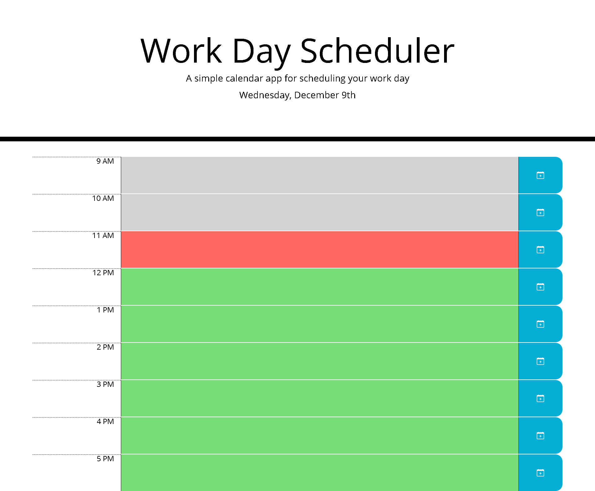

# Daily-Scheduler
Daily Scheduler is an application designed for schedule management for regular work hours 9am - 5pm. User can change and save event for each time block. Time blocks are color coded:
![#d3d3d3] Past Events
![#77dd77] Future Events
![#ff6961] Present Events

## Screenshots

## Live URL
https://alex-fok.github.io/Daily-Scheduler/